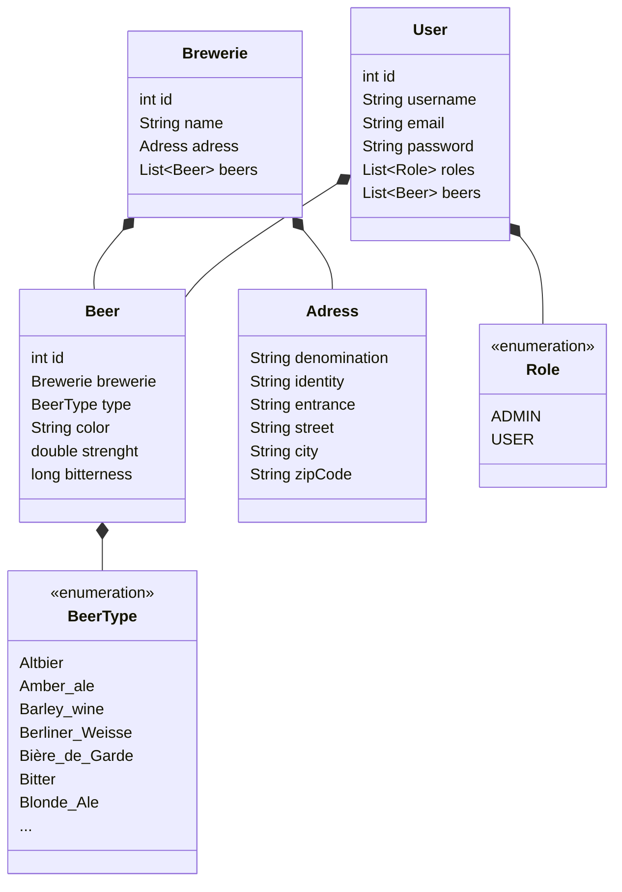

# HackOktoberfest
workspace for Hacktoberfest 2023

## Data model

```mermaid
classDiagram
    class Beer{
        int id
        Brewerie brewerie
        BeerType type
        String color
        double strenght
        long bitterness
    }

    class Brewerie {
        int id
        String name
        Adress adress
        List~Beer~ beers
    }

    Brewerie*--Beer

    class Adress{
        String denomination
        String identity
        String entrance
        String street
        String city
        String zipCode
    }

    Brewerie*--Adress

    class BeerType{
        <<enumeration>>
        Altbier
        Amber_ale
        Barley_wine
        Berliner_Weisse
        Bière_de_Garde
        Bitter
        Blonde_Ale
        ...
    }
    Beer*--BeerType

    class User{
        int id
        String username
        String email
        String password
        List~Role~ roles
        List~Beer~ beers
    }

    class Role{
        <<enumeration>>
        ADMIN
        USER
    }
    User*--Role
    User*--Beer

```
